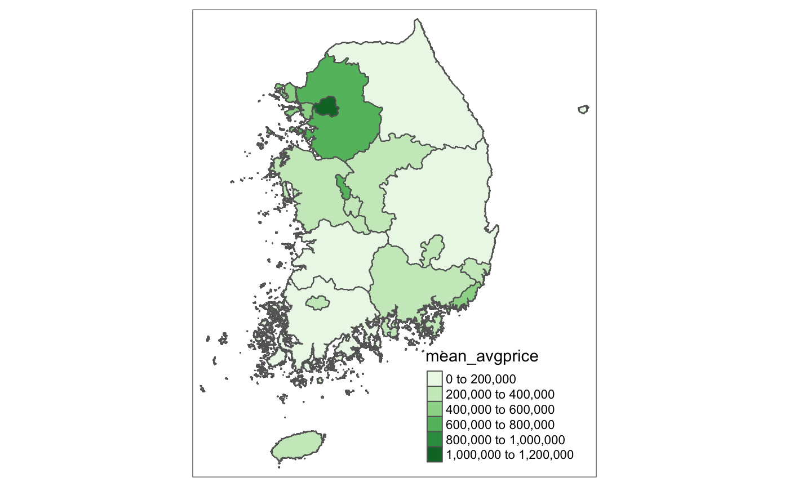
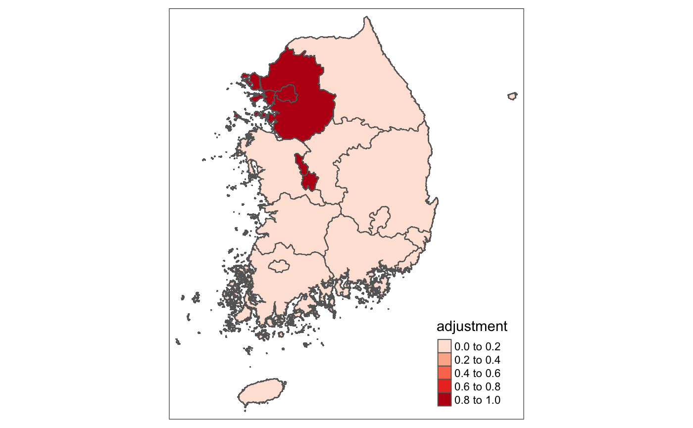

```{r, include=FALSE}
options(tinytex.verbose = TRUE)
```

```{r setup, include=FALSE}
knitr::opts_chunk$set(echo = TRUE, warning = FALSE, message = FALSE)
```

# Introduction
Last May, South Korea held a presidential election, and there was a change in the ruling party. The ousted party, Together Democratic Party, was led by President Moon, and there was no controversy over whether the administration’s notorious failure in curbing housing prices attributed was the reason the party lost.

Since President Moon was elected in 2017, the administration has implemented multiple policies to regulate Korean house prices to create more affordable housing. The administration implemented a total of 24 policy changes during the 5-year term. Yet, the consensus by the Korean public was that housing prices were soaring, citing the 52 percent increase in apartment prices in Seoul during his term. 

This paper will examine the following research question: “What were the impacts of the tightened mortgage policy and comprehensive real estate tax hike on multiple homeowners on Korean housing prices?”

To answer this question, the analysis will focus on two key policy changes: the tightening of mortgage loan regulation and the substantial increase in comprehensive real estate taxes on multiple homeowners. These regulations aimed to regulate the purchase of apartments for investment purposes, which the administration believed to be placing upward pressure on prices.

Through this policy analysis, we hope to investigate the relationship between the two regulations and the increase in housing prices in South Korea. Could the regulation impact enough households to drive down the increasing trend in housing prices?

\medspace

# Policy Changes
## Areas subject to adjustment / not subject to adjustment 
South Korea is made up of 17 first-tier administrative regions: one special city (Seoul), six metropolitan cities (Busan, Daegu, Incheon, Gwanju, Daejeon, Ulsan), one special self-governing city(Sejong), and nine provinces (Chungbuk, Chungnam, Gangwon, Gyeonggi, Gyeongbuk, Gyeongnam, Jeonbuk, Jeonnam, Jeju). These are further subdivided into smaller entities, including cities, counties, districts, towns, townships, neighborhoods, and villages. This paper will use the term “Region” to refer to these 17 first-tier administrative regions. 

The Moon administration introduced a concept of “areas subject to adjustment” to monitor and strengthen the housing market regulation in those areas. These areas were considered to be more likely to lead the housing price hike based on the increased rate of housing prices and the average level of housing prices. Areas subject to adjustment include Seoul, most of Gyeonggi, most of Incheon, Sejong, and Daejon. To simplify our analysis, we will consider five regions among 17 regions (Seoul, Gyeonggi, Incheon, Sejong, and Daejeon) the regions. However, the policy change did not affect all sub-regions in Gyeonggi and Incheon. 

## Mortgage Loan Regulation
In June 2017, to cope with the continuous price increase, the government continued to strengthen the LTV(the Loan-To-Value ratio), a measure comparing the amount of the mortgage with the appraised value of the property - and the DTI(the Debt-to-Income ratio), the percentage of the gross monthly income that goes towards payments for rent, mortgage, credit cards, or other debt. 

Since the LTV and the DTI affect the people’s ability to get a loan from the bank, reducing these ratios is considered to limit the mortgage loan and thus is expected to curb the housing price increase. 

Also, considering that reducing this ratio may have an adverse effect on those who need affordable housing, the regulation had to be introduced only in some selected areas where housing purchases for investment purposes are believed to be happening. Thus, these regulations were only strengthened in areas subject to adjustment. 

More detailed changes in the LTV and DTI are as follows: 
A. Regions subject to adjustment (5 regions): LTV and DTI increased by 10%.
- LTV: 70% → 60%
- DTI: 60% → 50%
B. Other regions (remaining 12 regions): LTV and DTI remain constant. (LTV 70%, DTI 60%) 

Although several other regulations on LTV and DTI were introduced afterward in 2019 and 2020, these changes have no difference among regions. To examine the impact of policy changes in different regions, we will focus on 2017’s policy change.

## Comprehensive Real Estate Tax CRET Rate Increase

A Comprehensive Real Estate Tax (CRET) is a national tax on a certain excessive aggregated statutory value of land and residential properties. This tax was first introduced in 2005 to slow the increase in housing prices by targeting owners with properties that have high appraised values or multiple homeowners. 

The tax rate remained at an average of 1.15% from 2009 to 2018. Since then, the average rate has increased to 1.35% in 2019 and 3.66% in 2021. Since CRET is a national tax, there is no difference in tax rate between the regions. However, the rate increase in 2021 was only introduced to the regions subject to adjustment. 

\medspace

# Data Description and Sources
## Data Source
All data were collected from Korea’s Statistical Information Service (kosis.kr), excluding the Comprehensive Real Estate Tax Rate from National Tax Service (nts.go.kr).

## Period of Observation
The observation period is from January 2012 to September 2022, covering the Moon administration’s 5-year and the former administration’s 5-year term.

## Details of Data

### Variable of outcome: average housing sale price 

The unit of observation is the average monthly apartment sale prices reported to the authority in that month in each Region. So we have month-region panel data. Since all apartment sales transactions should be reported to the housing authority within 30 days of the contract by the regulation, we can access almost all housing sale transactions that happened during the period. 

To note, there are 11 N/A values in the month-region panel data because Region Sejong was newly introduced in December 2012, so the sales data in this region is unavailable from January 2012 to November 2012. 

The unit of data is million won. 

### Control variable 1: interest rate

We used the Bank of Korea Policy Rate to observe the interest rate change among several interest rates set by the central bank. Since this rate serves as the rate the Bank of Korea uses to transact with financial institutions, it substantially influences the interest rate on mortgage loans. This data is a national level, yearly data. If there was more than one interest rate change in a year, we used the average interest rate (national-level yearly data). 

### Control variable 2: the average monthly income 

This variable measures the average monthly income of any individual paid in exchange for labor. It is obtained through a sampling survey by the labor authority. This is national-level data, which varies across periods (national-level monthly data). According to Jung and Lee, “[a] number of studies using aggregated or city-level data have found that positive shocks to household income lead to an acceleration in housing price increase when leverage ratios are higher” (2017). Hence, we include average monthly income as a control variable to reduce an omitted variable bias. The unit of observation is individual, and the sample size is 35,000 households in 1,737 districts.

### Control variable 3: the supply of housing 

This data is obtained by the total number of housing registered in the administrative region in that year (region-year panel data). The unit of observation is individual or household since the data measures the number of apartments owned by an individual or household in each region.

\newpage

# Descriptive Statistics

## Variable of outcome: Average housing sale price 

```{r echo=FALSE}
#load library
library(tidyverse)
library(tidyr)
library(dplyr)
library(lmtest)
library(sandwich)
library(stringr)
library(ggrepel)
library(fixest)
library(modelsummary)
library(stargazer)
library(plm)
library(kableExtra)
library(latexpdf)
library(gplots)
library(ggplot2)
library(rmarkdown)
library(tinytex)
library(Hmisc)
```

### Summary (mean, max, min, sd) of the average housing sale price by 17 Regions

```{r echo=FALSE}
#load dataset
avgprice <- read.csv("./dataset/Monthly_Average_Sale_Price.csv")

year <- c("Before 2018", "2019 and after", "2021 and after")
rate <- c(1.15, 1.38, 1.77)

ratetable <- data.frame(year, rate)

year <- c(2012, 2013, 2014, 2015, 2016, 2017, 2018, 2019, 2020, 2021, 2022)
rate <- c(1.15, 1.15, 1.15, 1.15, 1.15, 1.15, 1.15, 1.38, 1.38, 1.77, 1.77)

taxrate <- data.frame(year, rate)

#basic data management
names(avgprice)=str_sub(names(avgprice), 2)
colnames(avgprice)[colnames(avgprice) == 'egion'] <- 'Region'

avgprice_long <- avgprice %>% 
  pivot_longer(!Region,
               names_to = "month",
               names_transform = list(month = as.character),
               values_to = "avg_price",
               values_transform = list(avg_price = as.integer))
#-Note that the price is in 1,000 won.

avgprice_main <- avgprice_long %>% 
  mutate(avg_price = str_replace_all(avg_price, ",", "")) %>% 
  mutate(month.num = as.numeric(month),
         avgprice.num = as.numeric(avg_price))

#data management: separating year and month
avgprice_main$year.num = substr(avgprice_main$month, 1, 4)
avgprice_main$month = str_sub(avgprice_main$month, -2)

avgprice_main_sum <- avgprice_main %>% 
  group_by(Region) %>%
  select(avgprice.num) %>% 
  summarise_all(funs(mean, max, min, sd), na.rm = TRUE)

kable(avgprice_main_sum, caption = "Descriptive Statistics: Average Housing Sale Price", booktabs = TRUE) %>% 
  kable_styling(latex_options = "hold_position")
```

The mean of the average housing sale price varies greatly across the regions. The region with the lowest average sale price is Jeonnam, with 135,249, and the highest is Seoul, with 692,242.

\medspace

### Time trend of the average housing sale price by 17 Regions

```{r echo=FALSE}
avgprice_main_year <- avgprice_main %>%
  group_by(Region, year.num) %>%
  summarise(mean = mean(`avgprice.num`, na.rm =T))
avgprice_main_year <- avgprice_main_year[!(avgprice_main_year$Region=="Total"),]

avgprice_main_year <- avgprice_main_year %>% 
  mutate(mean = mean/1000)

ggplot(avgprice_main_year, aes(x=year.num, y = mean, color = Region)) + 
  geom_line(aes
            (group=Region)) +
  ggtitle("Time trend of Average Housing Sale Price by 17 Regions") +
  xlab("Year") + ylab("Average Housing Sale Price")
```

The time trend of the average housing sale price of 17 regions shows an upward trend in housing prices. In particular, the upward trend is most noticeable for the two regions with the highest average price: Seoul and Gyeonggi, followed by Busan and Incheon.

\newpage

## Variable of interest: Regions subject to adjustment/not subject to adjustment 

### Regions subject to adjustment/not subject to adjustment 

```{r echo = FALSE, out.width = "50%", fig.cap="Average Housing Price per Region", fig.align = 'center'}
#First Map: Average Housing Price per Region

```

```{r echo = FALSE, out.width = "50%", fig.cap="Average Housing Price Treatment vs Non-Treatment", fig.align = 'center'}
#Second Map: Average Housing Price Treatment vs Non-Treatment

```

The first map shows the average housing sale price by region. As the colors get darker, the average housing sale price is higher. The second map shows the adjustment regions. When compared side by side, it becomes obvious that regions with darker colors, or the highest average housing sale prices, are the adjustment regions set during the Moon administration. In other words, Seoul has the highest average price, followed by the outskirts (Gyeonggi and Incheon) of Seoul. Another notable area with darker color is also clustered around Daejeon and Sejong.

\newpage

### Time trend of the Average Housing Sale Price by Regions subject/not subject to adjustment

```{r echo=FALSE}
## The Trend of Panel data (Region-year.month data)
diffggplot <- readRDS(file = "./rds/diffggplot.rds")
diffggplot
```

The plot shows a time trend of regions subject and not subject to adjustment. The plot clearly shows that there is a steeper increase in housing prices after the policy implementation in 2017, implying that there can be a relationship between the policy and the housing price increase. Also, we can see that before 2018, we can see that there was a parallel trend in general between the regions.

\newpage

## Control Variables

### Bank of Korea Base Rate

```{r echo=FALSE, results='asis'}
#Data management
avgprice_groupby <- avgprice_main %>% 
  group_by(Region, year.num) %>% 
  summarize(mean_avgprice = mean(avgprice.num, na.rm=TRUE))

avgprice_groupby <- avgprice_groupby %>% 
  mutate(year.num = as.numeric(year.num))
colnames(taxrate)[1] <- "year.num"
taxrate <- taxrate %>% 
  mutate(year.num = as.numeric(year.num))

#joining tax rate with average housing price
avgprice_join <- left_join(avgprice_groupby, taxrate, by = c("year.num"))

#Assign tax rate for adjustment area after 2021: t = 3.66%
#Adjustment areas: Seoul, Gyeonggi, Incheon, Sejong, and Daejeon
year.num <- c(2012, 2013, 2014, 2015, 2016, 2017, 2018, 2019, 2020, 2021, 2022)
rate <- c(1.15, 1.15, 1.15, 1.15, 1.15, 1.15, 1.15, 1.38, 1.38, 3.66, 3.66)
adjustment <- data.frame(year.num, rate)

#joining tax rate for adjustment areas
avgprice_adj <- avgprice_join %>% 
  mutate(adjustment = ifelse(Region == "Seoul" | Region == "Gyeonggi" | Region == "Incheon" | Region == "Sejong" | Region == "Daejeon", 1, 0))

avgprice_df <- avgprice_adj %>% 
  mutate(rate = ifelse(adjustment == 1 & year.num > 2020, yes = 3.66, no = avgprice_adj$rate))

# Introducing Control Variables
policy_rate <- read.csv("./dataset/BoK_Base_Rate.csv")

#set up policy rate
names(policy_rate) = str_sub(names(policy_rate), 2)
colnames(policy_rate)[1] <- "rates"

policy_long <- policy_rate %>% 
  pivot_longer(cols =! "rates",
               names_to = "year",
               values_to = "interest") %>% 
  filter(rates == "Base Rate")

#set up average income
avgincome <- read.csv("./dataset/Average_Income.csv")

names(avgincome) <- gsub(".", " ", names(avgincome), fixed = TRUE)

colnames(avgincome)[4] <- "AvgMonthlyIncome"

avgincome_long <- avgincome %>% 
  select("Time", "AvgMonthlyIncome")

colnames(avgincome_long)[1] <- "year"

#create combined data frame
avgincome_long <- avgincome_long %>% 
  mutate(year.num = as.numeric(year))
policy_long <- policy_long %>% 
  mutate(year.num = as.numeric(year))

control <- left_join(avgincome_long, policy_long, by = "year.num")

avgprice_control <- left_join(avgprice_df, control, by = "year.num", na.rm=TRUE)
avgprice_control <- avgprice_control[!(avgprice_control$Region=="Total"),]

#set up total apartments supply
supply <- read.csv("./dataset/Total_Apartments.csv")

names(supply)=str_sub(names(supply), 2)
colnames(supply)[colnames(supply) == 'egion'] <- 'Region'

supply_long <- supply %>% 
  pivot_longer(cols =! "Region",
               names_to = "year",
               values_to = "apartments")

colnames(supply_long)[2] <- "year.num"

avgincome_long <- avgincome_long %>% 
  mutate(year.num = as.numeric(year.num))
supply_long <- supply_long %>% 
  mutate(year.num = as.numeric(year.num))

avgprice_control <- left_join(avgprice_control, supply_long, by = c("year.num", "Region"), na.rm=TRUE)

#Changing housing price unit
avgprice_control <- avgprice_control %>% 
  mutate(mean_avgprice = mean_avgprice/1000)

view(policy_long) %>% 
  select(year, interest) %>% 
  kable(caption = "Distribution of BoK Base Rate", booktabs = TRUE) %>% 
  kable_styling(latex_options = "hold_position")
```

The base rate continued to decrease from 2012 to 2016. In 2017 and 2018, Bank of Korea increased the base rate slightly. In 2020, Bank of Korea dramatically decreased the rate to nearly 0% to tackle the sluggish economy caused by pandemic. 

### Average Monthly Income

```{r echo=FALSE}
view(avgincome_long) %>% 
  select(year, AvgMonthlyIncome) %>% 
  kable(caption = "Distribution of Average Monthly Income", booktabs = TRUE) %>% 
  kable_styling(latex_options = "hold_position")
```

The average monthly income grew consistently from 2012 to 2022. Now, the average monthly income is 2.88 million won (USD 2,880).

\newpage

### Housing Supply

```{r echo=FALSE}
supply_1000 <- supply_long %>% 
  mutate(apartments = apartments/1000)

ggplot(supply_1000, aes(x=year.num, y = apartments, color = Region)) + 
  geom_line(aes
            (group=Region)) +
  ggtitle("Time trend of Housing Supply by 17 Regions") +
  xlab("Year") + ylab("Housing Supply")
```

From 2012 to 2022, housing supply increased consistently. Seoul and Gyeonggi take up the largest share of the housing market, followed by Busan and Incheon. In particular, supply of housing in Gyeonggi accelerated at around 2017 and has maintained its relatively high growth since then. Further, we can observe a high discrepancy in housing supply between the regions.

\newpage

## Difference in Means

```{r echo=FALSE}
colnames(avgprice_main)[6] <- "year.num"
avgprice_main <- avgprice_main[!(avgprice_main$Region=="Total"),]

avgprice_treat <- avgprice_main %>%
  mutate(treatment = ifelse(Region == "Seoul" & (year.num >=2018 | month.num =="2017.12" | month.num == "2017.11" | month.num == "2017.10"| month.num =="2017.09" | month.num == "2017.08"| month.num == "2017.07") 
                            |Region == "Gyeonggi"& (year.num >=2018 | month.num =="2017.12" | month.num == "2017.11" | month.num == "2017.10"| month.num =="2017.09" | month.num == "2017.08"| month.num == "2017.07")
                            |Region == "Incheon"& (year>=2018 | month.num =="2017.12" | month.num == "2017.11" | month.num == "2017.10"| month.num =="2017.09" | month.num == "2017.08"| month.num == "2017.07")
                            |Region == "Sejong"& (year.num >=2018 | month.num =="2017.12" | month.num == "2017.11" | month.num == "2017.10"| month.num =="2017.09" | month.num == "2017.08"| month.num == "2017.07")
                            |Region == "Daejeon"& (year.num >=2018 | month.num =="2017.12" | month.num == "2017.11" | month.num == "2017.10"| month.num =="2017.09" | month.num == "2017.08"| month.num == "2017.07")
                            |Region == "Sejong"& (year.num >=2018 | month.num =="2017.12" | month.num == "2017.11" | month.num == "2017.10"| month.num =="2017.09" | month.num == "2017.08"| month.num == "2017.07"), 1, 0)) %>%
  mutate(year = as.numeric(year.num)) %>%
  select(Region, year.num, month.num, treatment, avgprice.num)

datasummary_diff <- datasummary_balance(housing_treatment ~ treatment, 
                    data = avgprice_treat,
                    title = "Difference-in-means between adjusted regions after policy implmentation and others")
datasummary_diff %>% 
  kable_styling(latex_options = "hold_position")
```


Difference in means between regions subject to adjustment after policy implementation and others is 254,765, which can imply the policy increases the average housing price.

0: Regions not subject to adjustment or Regions subject to adjustment but before the policy implementation 
1: Regions subject to adjustment & after policy implementation 

\newpage

# Empirical Strategy

Our treatment entails introducing stronger loan and tax regulations on real estate purchases. In the absence of random assignment, factors that contribute to the treatment are the impact of COVID-19 on the increase/decrease of the loan amount, change in supply and demand for housing, interest rate (Bank of Korea’s policy rate), economic cycle, inflation, general tax levels, and unemployment rate. 

The nature of our policy/treatment variation stems from using time-variant data (the implementation of loan regulation and tax increase) on time-invariant observations (geographic region). The policy is time-variant because loan and tax regulations were strengthened during the previous administration (2017-2022). Also, the mortgage loan regulations and some of the tax increases (the tax increase in 2021) had different impacts at local levels, while most of the tax increases were national policy that affected all regions equally.

\medspace

## CRET Rate and the Average Housing Sale Price

$$AvgHousingSalePrice_{ist} = \beta_0 + \beta_1 CRET Rate_{is} + \beta_2 AvgMonthlyIncome_{it} + \beta_3 BaseRate_{it} + \varepsilon_{st}$$
where $Y_{ist}$ is the outcome of interest (average housing sale price) in Region $s$ and year $t$; and $\varepsilon_{st}$ is an idiosyncratic error term.

The above equation is the PRF function for measuring how the Average Housing Sale Price is affected by the CRET Rate, controlling for Bank of Korea’s policy rate, average monthly income, and supply of housing.

```{r echo=FALSE, results='asis'}
#Regression table
ols <- lm(mean_avgprice ~ rate, data = avgprice_control)
ols1 <- lm(mean_avgprice ~ rate + AvgMonthlyIncome, data = avgprice_control)
ols2 <- lm(mean_avgprice ~ rate + AvgMonthlyIncome + interest, data = avgprice_control)
ols3 <- lm(mean_avgprice ~ rate + AvgMonthlyIncome + interest + apartments, data = avgprice_control)

model.list = list(ols, ols1, ols2, ols3)

stargazer(ols,
          ols1,
          ols2,
          ols3,
          title = "How Average Housing Sale Price is affected by CRET rate, controlling for Average monthly income, BoK policy rate, Housing Supply",
          type = "latex",
          float = TRUE,
          report = "vcs*",
          no.space = TRUE,
          header = FALSE,
          single.row = TRUE,
          font.size = "small",
          intercept.bottom = F,
          column.separate = c(1,1,1,1),
          covariate.labels = c("Constant", "CRET Rate", "Avg Monthly Income", "Base Rate", "Housing Supply"),
          digits = 2,
          t.auto = F,
          p.auto = F,
          notes.align = "l",
          notes.append = TRUE
          )
```

The regression results show that the association between the CRET rate and Average Housing Sale Price was statistically significant at the 1% level in all four models. On average, for every 1% increase in the CRET rate, the average housing sale price increased by 156 million Won (USD 120,000). The magnitude of the increase decreased as we added more control variables, but the CRET rate increased the Average Housing Sale Price in all four models.

\newpage

```{r echo=FALSE}
#FE with Region fixed effect: housing_price = beta0 + CRET Rate + regionFE + error

#lm
  CRET_FE_model <- list(
    "FE 1" = feols(mean_avgprice ~ rate 
                   | Region,
                   data = avgprice_control),   
    "FE 2" = feols(mean_avgprice ~ rate + AvgMonthlyIncome
                   | Region,
                   data = avgprice_control),
    "FE 3" = feols(mean_avgprice ~ rate + AvgMonthlyIncome + interest 
                   | Region,
                   data = avgprice_control),
    "FE 4" = feols(mean_avgprice ~ rate + AvgMonthlyIncome + interest + apartments
                   | Region,
                   data = avgprice_control)
  )

  CRET_FE_model_sum <- modelsummary(CRET_FE_model,
               coef_omit = "Intercept",
               gof_omit = 'DF|Deviance|R2 Pseudo|AIC|BIC|Log.Lik.',
               stars = c('*' = .1, '**' = .05, '***' = .01),
               coef_rename = c("rate" = "CRET Rate", "AvgMonthlyIncome" = "Avg Monthly Income", "interest" = "Base Rate", "apartments" = "Housing Supply"))
  CRET_FE_model_sum
```

We used a region-fixed model to see the variation in average housing sale prices after the policy
change of increasing the CRET rate to adjustment and non-adjustment areas (at different levels) was implemented, controlling for any variations between the regions, i.e., a policy that changed people’s perception towards owning a house versus renting, which may have contributed to the results. On average, for every 1% increase in the CRET rate, the average housing sale price increased by 124 million Won. An interesting trend is the magnitude of the increase decreased significantly as more control variables were added to the regression model. This suggests that, when controlling for regional variations and the three variables, the lower CRET rate worked against the intended policy direction to increase the average housing sale price.

\newpage

## Loan Regulations and the Average Housing Sale Price

### Diff-in-diff Estimation

As observed above in the graph, "Time trend of the Average Housing Sale Price by Regions subject/not subject to adjustment", there seems to be a parallel trend between the regions subject to adjustment and not subject to adjustment before the loan policy implementation (before June 2017). Thus, the parallel assumption for DID estimation holds. 

```{r echo=FALSE}
avgprice_total <- avgprice_main %>%
  mutate(adjustment = ifelse(Region == "Seoul"|Region == "Gyeonggi"|Region == "Incheon"|Region == "Sejong"|Region == "Daejeon"|Region == "Sejong", 1, 0)) %>%
  mutate(policy = ifelse(year.num >= 2018 | month.num =="2017.12" | month.num == "2017.11" | month.num == "2017.10"|
                           month.num =="2017.09" | month.num == "2017.08"| month.num == "2017.07", 1, 0)) %>%
  select(Region, year.num, month.num, adjustment, policy, avgprice.num)

avgprice_total_did <- avgprice_total %>%
  mutate(adjustedregion_afterpolicy = adjustment*policy)

ols_did <- lm(avgprice.num ~ adjustedregion_afterpolicy + adjustment + policy, data = avgprice_total_did)
coeftest(ols_did, vcov = vcovHC(ols_did, type = "HC1"))
```

Using regression-based DID estimation, the DID estimator is the coefficient of the variable “adjustmentregion_afterpolicy”. According to the DID estimator, if we compare i) the gap of the average housing sale price between the regions subject to and not subject to adjustment before policy implementation and ii) the same gap after the policy implementation, the latter is greater by 134,935. This implies that the policy implementation is associated with the increase in the average housing sale price. 

However, this method cannot take into account the effect of the impact of some changes in other factors over the period. In other words, if there was another shock other than the policy implementation around 2018, the parallel assumption no longer holds, and we cannot tell if the policy change can explain the difference in differences.

The PRF for the DID estimation is as follows:
$$AvgHousingSalePrice_{ist} = \beta_0 + \beta_1 AdjustedRegion_{ist} + \beta_2 AfterPolicy_{ist} + \beta_3 AdjustedRegion AfterPolicy_{ist} + \varepsilon_{ist}$$
AvgHousingSalePrice is the outcome of interest in Region s in month t; AdjustedRegion is a binary variable showing the Region s is subject or not subject to adjustment region; AfterPolicy is a binary variable showing month t is after or before the policy implementation; AdjustedRegion*AfterPolicy is a binary variable showing if the Region s at month t is subject or not subject to adjustment region and if it is after or before the policy implementation. 

\medspace

## Fixed effect (Region & Year) Model with Control Variables

```{r echo=FALSE}
# 2. Fixed-effect model
avgprice_adjust <- avgprice_main %>%
  mutate(adjustment = ifelse(Region == "Seoul"|Region == "Gyeonggi"|Region == "Incheon"|Region == "Sejong"|Region == "Daejeon"|Region == "Sejong", 1, 0)) %>%
  mutate(year.num = as.numeric(year.num)) %>%
  mutate(year.num = as.numeric(year.num)) %>%
  mutate(t = year.num - 2017)%>%
  select(year.num, t, adjustment, avgprice.num)

aggTS <- avgprice_adjust %>%
           group_by(year.num) %>%
           summarize(housing = mean(avgprice.num, na.rm=T), .groups = 'drop') %>%
           mutate(grp = "All Regions")
         
eligTS <-avgprice_adjust %>%
           group_by(year.num, adjustment) %>%
           summarize(housing = mean(avgprice.num, na.rm = T), .groups = 'drop') %>%
           mutate(grp = ifelse(adjustment == 1, "Regions subject to adjustment", "Regions not subject to adjustment")) %>%
           bind_rows(aggTS) 

avgprice_treat <- avgprice_treat %>% 
  mutate(year.num = as.numeric(year.num))
avgprice_treat_control <- left_join(avgprice_treat, avgprice_control, by = c("year.num", "Region"), na.rm=TRUE)

avgprice_treat <- avgprice_treat %>%
  mutate(month.num = as.factor(month.num),
         Region = as.factor(Region))

#group by year and Region : changing the month-region data to year-region data
avgprice_groupby <- avgprice_treat %>% 
  group_by(Region, year.num) %>% 
  mutate(avgprice.num = avgprice.num/1000) %>% 
  summarize(mean_avgprice = mean(avgprice.num, na.rm=TRUE), treatment = min(treatment, na.rm=TRUE))

avgprice_groupby <- avgprice_groupby %>% 
  mutate(year.num = as.numeric(year.num)) %>%
  select(Region, treatment, year.num, mean_avgprice)
```

$$AvgHousingSalePrice_{ist} = \beta_0 + \beta_1 treatment_{ist} + \beta_2 AvgMonthlyIncome_{it} + \beta_3 BoKBaseRate_{it} + \beta_4 Apartments_{ist}  \varepsilon_{st}$$

where $Y_{ist}$ is the outcome of interest (average housing sale price) in Region $s$ and year $t$; and $\varepsilon_{st}$ is an idiosyncratic error term.


$$AvgHousingSalePrice_{st} = \beta_0 + \beta_1 treatment_{st} + Region_{s} + Year_{t} + \varepsilon_{st}$$

where $Y_{ist}$ is the outcome of interest (average housing sale price) in Region $s$ and year $t$; $Region_{s}$ is region fixed effect in region s; $Year_{t}$ is time fixed effect at time t; and $\varepsilon_{st}$ is an idiosyncratic error term.

\newpage

```{r echo=FALSE}
colnames(avgprice_groupby)[3] <- "year.num"
avgprice_control <- avgprice_control %>% 
  select(Region, mean_avgprice, year.num, rate, AvgMonthlyIncome, interest, apartments)
avgprice_groupby_control <- left_join(avgprice_groupby, avgprice_control, by = c("year.num", "Region"), na.rm=TRUE)
colnames(avgprice_groupby_control)[4] <- "mean_avgprice"
avgprice_groupby_control <- avgprice_groupby_control %>% 
  select(-mean_avgprice.y)

## Regression tables
models_fe <- list(
  "FE 1" = feols(mean_avgprice ~ treatment
                 | Region,
                 data = avgprice_groupby_control),   
  "FE 2" = feols(mean_avgprice ~ treatment + interest
                 | Region,
                 data = avgprice_groupby_control),
  "FE 3" = feols(mean_avgprice ~ treatment + AvgMonthlyIncome
                 | Region,
                 data = avgprice_groupby_control),
  "FE 4" = feols(mean_avgprice ~ treatment + apartments
                 | Region,
                 data = avgprice_groupby_control),
  "FE 5" = feols(mean_avgprice ~ treatment + interest + AvgMonthlyIncome + apartments
                 | Region,
                 data = avgprice_groupby_control),
  "FE 6" = feols(mean_avgprice ~ treatment 
                 | Region + year.num,
                 data = avgprice_groupby_control)
  )

  models_fe_sum<- modelsummary(models_fe,
               coef_omit = "Intercept",
               gof_omit = 'DF|Deviance|R2 Pseudo|AIC|BIC|Log.Lik.',
               stars = c('*' = .1, '**' = .05, '***' = .01),
               coef_rename = c("treatment" = "Treatment", "interest" = "Base Rate", "AvgMonthlyIncome" = "Avg Monthly Income", "apartments" = "Housing Supply"))
  models_fe_sum %>% 
    kable_styling(latex_options = "hold_position")
```

For the last method, we introduced a fixed effect model to see the effect of implementation of a stronger regulation on adjusted regions on housing price, controlling for region and time fixed effect. If we control for both time and region fixed effects as in this FE 6 model, the coefficient on treatment becomes a bit greater than the previous method, which implies that the regional and time specific factors have underestimated the impact of policy in the DID model. More in detail, the strengthened regulation on mortgage loans increases the average housing price by 174.187 million Won, and this is statistically significant at 0.01 level, controlling for region specific and time invariant effects and factors vary over time but are constant across regions. 

Also, we introduced some control variables. Interest rate and the average monthly income are national level but time varying factors, so their impact can be partially captured by the region fixed effect model. However, since the variable of supply of housing is time-varying and different across regions, this cannot be captured by a fixed effects model. 

\newpage

# Findings

By increasing tax rate on housing ownership and strengthening loan regulation, the Moon administration intended to curb the skyrocketing housing prices. However, as observed from above regression results, we see that both policies rather increased the average housing sale prices, as opposed to original policy intention.

- Finding 1: Every 1% increase in CRET rate increased the average housing sale price by around 100 million won, although the magnitude of increase was smaller when controlling for regional variations and the three variables.

- Finding 2: Strengthened regulation on mortgage loans increases the average housing price by 174.187 million Won, and this is statistically significant at 0.01 level, controlling for region specific and time invariant effects and factors vary over time but are constant across regions.

# Conclusion

Our findings confirm that the nation-wide analysis that the policies implemented by President Moon’s administration to control rising housing prices was a failure. The regulations were not effective in guiding the prices in the intended policy direction, hinting that further exploration is necessary to determine true drivers behind South Korean housing market from 2017 to 2022. In other words, our research is limited by omitted variables that were not explored in this paper due to reasons such as difficulty in quantifying the variables. 

## Limitations

The omitted variables for CRET rate are factors that are time variant but constant across regions.
- Generational differences in viewing housing as an asset. Increasingly, the 20-30s population in South Korea started viewing housing as an asset, due to the rise in pessimistic outlook that the country’s economic growth and prosperity is on a decline. This may be driven by enhigtened geographical tension, low birth rate, increasing competition in education and employment, and more. In turn, many South Koreans started to perceive that wealth is generational, not an accumulation. This may have led them to gather all of their savings to purchase housing as an asset they will pass onto their children for their wealth.

- Values of other assets. If the value of other assets plummeted during the period, then people are more likely to be inclined to purchase housing, whose prices were on an increasing trend.

- Volatility in prices of other assets. As perceived risk of other assets increase, due to its volatility, i.e., digital currency or stocks, then people are more likely to view housing as a an asset with enough stability and less risk that its values will not dramatically decline, and are more likely to purchase housing.

The omitted variables for mortgage loan analysis are factors that are time variant and vary across regions as well.

- People’s expectations for housing price increases: People have different expectations for future housing price increases according to where the housing is located. For example, in general, regions around Seoul are expected to have higher housing prices. Also, if there is some news for new development in that area, that can also affect the housing price in that region. In addition, these expectations can be greatly affected by government policy changes, implying that this can greatly change over time. From the perspective of housing demand, it may be the case that people’s expectations for housing price increases were so strong that people could have greater demand for housing, in spite of higher tax rates and the difficulty of having mortgage loans. 

- Cost of home ownership: If costs such as maintenance, or the opportunity cost of owning a house decreased, then people are more likely to purchase housing rather than renting. This is because the decrease in the cost of home ownership increases the return from purchasing housing.

- Population: Demographic features can also affect housing demand. For example, if there is an increase in population or an influx of a large population into a certain area, this can cause a housing price hike. For example, in our analysis, Sejong, which is one of the regions subject to adjustment, still experienced a high housing price increase. Considering that Sejong is a newly built city in 2012 and many young people have moved to that city since then, the housing price hike in this region may be the result of the change in population, rather than the failure of the policies.

# References

- Korea Statistical Information Service (kosis.kr)

- Korea National Tax Service (nts.go.kr)