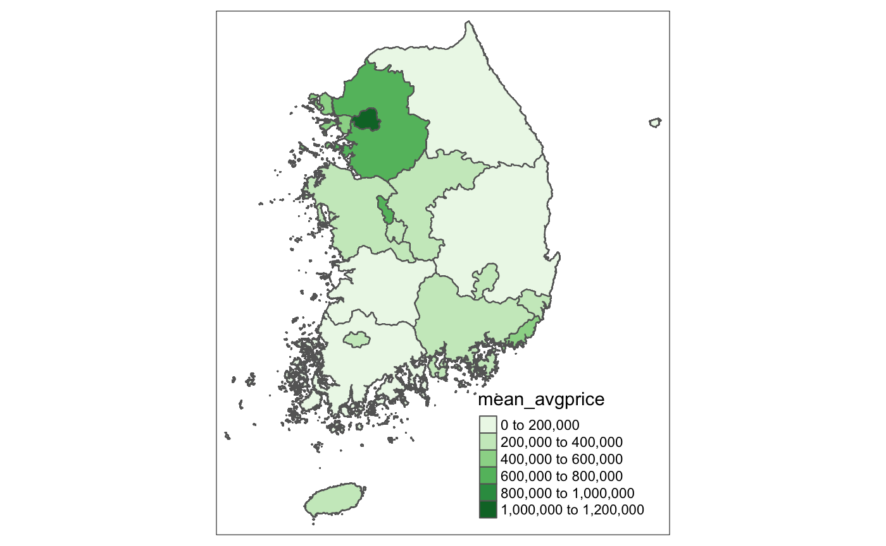
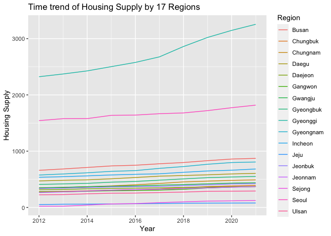

# Introduction

Last May, South Korea held a presidential election, and there was a
change in the ruling party. The ousted party, Together Democratic Party,
was led by President Moon, and there was no controversy over whether the
administration’s notorious failure in curbing housing prices attributed
was the reason the party lost.

Since President Moon was elected in 2017, the administration has
implemented multiple policies to regulate Korean house prices to create
more affordable housing. The administration implemented a total of 24
policy changes during the 5-year term. Yet, the consensus by the Korean
public was that housing prices were soaring, citing the 52 percent
increase in apartment prices in Seoul during his term.

This paper will examine the following research question: “What were the
impacts of the tightened mortgage policy and comprehensive real estate
tax hike on multiple homeowners on Korean housing prices?”

To answer this question, the analysis will focus on two key policy
changes: the tightening of mortgage loan regulation and the substantial
increase in comprehensive real estate taxes on multiple homeowners.
These regulations aimed to regulate the purchase of apartments for
investment purposes, which the administration believed to be placing
upward pressure on prices.

Through this policy analysis, we hope to investigate the relationship
between the two regulations and the increase in housing prices in South
Korea. Could the regulation impact enough households to drive down the
increasing trend in housing prices?

# Policy Changes

## Areas subject to adjustment / not subject to adjustment

South Korea is made up of 17 first-tier administrative regions: one
special city (Seoul), six metropolitan cities (Busan, Daegu, Incheon,
Gwanju, Daejeon, Ulsan), one special self-governing city(Sejong), and
nine provinces (Chungbuk, Chungnam, Gangwon, Gyeonggi, Gyeongbuk,
Gyeongnam, Jeonbuk, Jeonnam, Jeju). These are further subdivided into
smaller entities, including cities, counties, districts, towns,
townships, neighborhoods, and villages. This paper will use the term
“Region” to refer to these 17 first-tier administrative regions.

The Moon administration introduced a concept of “areas subject to
adjustment” to monitor and strengthen the housing market regulation in
those areas. These areas were considered to be more likely to lead the
housing price hike based on the increased rate of housing prices and the
average level of housing prices. Areas subject to adjustment include
Seoul, most of Gyeonggi, most of Incheon, Sejong, and Daejon. To
simplify our analysis, we will consider five regions among 17 regions
(Seoul, Gyeonggi, Incheon, Sejong, and Daejeon) the regions. However,
the policy change did not affect all sub-regions in Gyeonggi and
Incheon.

## Mortgage Loan Regulation

In June 2017, to cope with the continuous price increase, the government
continued to strengthen the LTV(the Loan-To-Value ratio), a measure
comparing the amount of the mortgage with the appraised value of the
property - and the DTI(the Debt-to-Income ratio), the percentage of the
gross monthly income that goes towards payments for rent, mortgage,
credit cards, or other debt.

Since the LTV and the DTI affect the people’s ability to get a loan from
the bank, reducing these ratios is considered to limit the mortgage loan
and thus is expected to curb the housing price increase.

Also, considering that reducing this ratio may have an adverse effect on
those who need affordable housing, the regulation had to be introduced
only in some selected areas where housing purchases for investment
purposes are believed to be happening. Thus, these regulations were only
strengthened in areas subject to adjustment.

More detailed changes in the LTV and DTI are as follows: A. Regions
subject to adjustment (5 regions): LTV and DTI increased by 10%. - LTV:
70% → 60% - DTI: 60% → 50% B. Other regions (remaining 12 regions): LTV
and DTI remain constant. (LTV 70%, DTI 60%)

Although several other regulations on LTV and DTI were introduced
afterward in 2019 and 2020, these changes have no difference among
regions. To examine the impact of policy changes in different regions,
we will focus on 2017’s policy change.

## Comprehensive Real Estate Tax CRET Rate Increase

A Comprehensive Real Estate Tax (CRET) is a national tax on a certain
excessive aggregated statutory value of land and residential properties.
This tax was first introduced in 2005 to slow the increase in housing
prices by targeting owners with properties that have high appraised
values or multiple homeowners.

The tax rate remained at an average of 1.15% from 2009 to 2018. Since
then, the average rate has increased to 1.35% in 2019 and 3.66% in 2021.
Since CRET is a national tax, there is no difference in tax rate between
the regions. However, the rate increase in 2021 was only introduced to
the regions subject to adjustment.

# Data Description and Sources

## Data Source

All data were collected from Korea’s Statistical Information Service
(kosis.kr), excluding the Comprehensive Real Estate Tax Rate from
National Tax Service (nts.go.kr).

## Period of Observation

The observation period is from January 2012 to September 2022, covering
the Moon administration’s 5-year and the former administration’s 5-year
term.

## Details of Data

### Variable of outcome: average housing sale price

The unit of observation is the average monthly apartment sale prices
reported to the authority in that month in each Region. So we have
month-region panel data. Since all apartment sales transactions should
be reported to the housing authority within 30 days of the contract by
the regulation, we can access almost all housing sale transactions that
happened during the period.

To note, there are 11 N/A values in the month-region panel data because
Region Sejong was newly introduced in December 2012, so the sales data
in this region is unavailable from January 2012 to November 2012.

The unit of data is million won.

### Control variable 1: interest rate

We used the Bank of Korea Policy Rate to observe the interest rate
change among several interest rates set by the central bank. Since this
rate serves as the rate the Bank of Korea uses to transact with
financial institutions, it substantially influences the interest rate on
mortgage loans. This data is a national level, yearly data. If there was
more than one interest rate change in a year, we used the average
interest rate (national-level yearly data).

### Control variable 2: the average monthly income

This variable measures the average monthly income of any individual paid
in exchange for labor. It is obtained through a sampling survey by the
labor authority. This is national-level data, which varies across
periods (national-level monthly data). According to Jung and Lee, “\[a\]
number of studies using aggregated or city-level data have found that
positive shocks to household income lead to an acceleration in housing
price increase when leverage ratios are higher” (2017). Hence, we
include average monthly income as a control variable to reduce an
omitted variable bias. The unit of observation is individual, and the
sample size is 35,000 households in 1,737 districts.

### Control variable 3: the supply of housing

This data is obtained by the total number of housing registered in the
administrative region in that year (region-year panel data). The unit of
observation is individual or household since the data measures the
number of apartments owned by an individual or household in each region.

# Descriptive Statistics

## Variable of outcome: Average housing sale price

### Summary (mean, max, min, sd) of the average housing sale price by 17 Regions

<table class="table" style="margin-left: auto; margin-right: auto;">
<caption>
Descriptive Statistics: Average Housing Sale Price
</caption>
<thead>
<tr>
<th style="text-align:left;">
Region
</th>
<th style="text-align:right;">
mean
</th>
<th style="text-align:right;">
max
</th>
<th style="text-align:right;">
min
</th>
<th style="text-align:right;">
sd
</th>
</tr>
</thead>
<tbody>
<tr>
<td style="text-align:left;">
Busan
</td>
<td style="text-align:right;">
275853.1
</td>
<td style="text-align:right;">
436477
</td>
<td style="text-align:right;">
210323
</td>
<td style="text-align:right;">
67835.28
</td>
</tr>
<tr>
<td style="text-align:left;">
Chungbuk
</td>
<td style="text-align:right;">
154209.9
</td>
<td style="text-align:right;">
219062
</td>
<td style="text-align:right;">
132926
</td>
<td style="text-align:right;">
23930.65
</td>
</tr>
<tr>
<td style="text-align:left;">
Chungnam
</td>
<td style="text-align:right;">
161367.7
</td>
<td style="text-align:right;">
214801
</td>
<td style="text-align:right;">
135428
</td>
<td style="text-align:right;">
22385.01
</td>
</tr>
<tr>
<td style="text-align:left;">
Daegu
</td>
<td style="text-align:right;">
270549.5
</td>
<td style="text-align:right;">
407829
</td>
<td style="text-align:right;">
173973
</td>
<td style="text-align:right;">
67960.10
</td>
</tr>
<tr>
<td style="text-align:left;">
Daejeon
</td>
<td style="text-align:right;">
248950.2
</td>
<td style="text-align:right;">
400749
</td>
<td style="text-align:right;">
197420
</td>
<td style="text-align:right;">
67875.42
</td>
</tr>
<tr>
<td style="text-align:left;">
Gangwon
</td>
<td style="text-align:right;">
136823.7
</td>
<td style="text-align:right;">
187223
</td>
<td style="text-align:right;">
115567
</td>
<td style="text-align:right;">
20681.90
</td>
</tr>
<tr>
<td style="text-align:left;">
Gwangju
</td>
<td style="text-align:right;">
198073.7
</td>
<td style="text-align:right;">
302168
</td>
<td style="text-align:right;">
136544
</td>
<td style="text-align:right;">
50824.54
</td>
</tr>
<tr>
<td style="text-align:left;">
Gyeongbuk
</td>
<td style="text-align:right;">
139549.1
</td>
<td style="text-align:right;">
175522
</td>
<td style="text-align:right;">
108749
</td>
<td style="text-align:right;">
16535.12
</td>
</tr>
<tr>
<td style="text-align:left;">
Gyeonggi
</td>
<td style="text-align:right;">
348572.0
</td>
<td style="text-align:right;">
610363
</td>
<td style="text-align:right;">
260103
</td>
<td style="text-align:right;">
105459.76
</td>
</tr>
<tr>
<td style="text-align:left;">
Gyeongnam
</td>
<td style="text-align:right;">
189823.1
</td>
<td style="text-align:right;">
244014
</td>
<td style="text-align:right;">
170188
</td>
<td style="text-align:right;">
19222.96
</td>
</tr>
<tr>
<td style="text-align:left;">
Incheon
</td>
<td style="text-align:right;">
268201.8
</td>
<td style="text-align:right;">
440075
</td>
<td style="text-align:right;">
198262
</td>
<td style="text-align:right;">
71645.14
</td>
</tr>
<tr>
<td style="text-align:left;">
Jeju
</td>
<td style="text-align:right;">
237492.5
</td>
<td style="text-align:right;">
331434
</td>
<td style="text-align:right;">
134994
</td>
<td style="text-align:right;">
68057.35
</td>
</tr>
<tr>
<td style="text-align:left;">
Jeonbuk
</td>
<td style="text-align:right;">
145761.2
</td>
<td style="text-align:right;">
195468
</td>
<td style="text-align:right;">
132554
</td>
<td style="text-align:right;">
17943.60
</td>
</tr>
<tr>
<td style="text-align:left;">
Jeonnam
</td>
<td style="text-align:right;">
135249.4
</td>
<td style="text-align:right;">
187454
</td>
<td style="text-align:right;">
109014
</td>
<td style="text-align:right;">
26662.84
</td>
</tr>
<tr>
<td style="text-align:left;">
Sejong
</td>
<td style="text-align:right;">
324903.6
</td>
<td style="text-align:right;">
727277
</td>
<td style="text-align:right;">
143257
</td>
<td style="text-align:right;">
177171.86
</td>
</tr>
<tr>
<td style="text-align:left;">
Seoul
</td>
<td style="text-align:right;">
692242.9
</td>
<td style="text-align:right;">
1151721
</td>
<td style="text-align:right;">
488116
</td>
<td style="text-align:right;">
214949.90
</td>
</tr>
<tr>
<td style="text-align:left;">
Total
</td>
<td style="text-align:right;">
324780.8
</td>
<td style="text-align:right;">
514584
</td>
<td style="text-align:right;">
248058
</td>
<td style="text-align:right;">
81748.48
</td>
</tr>
<tr>
<td style="text-align:left;">
Ulsan
</td>
<td style="text-align:right;">
235692.0
</td>
<td style="text-align:right;">
325626
</td>
<td style="text-align:right;">
195867
</td>
<td style="text-align:right;">
37231.22
</td>
</tr>
</tbody>
</table>

The mean of the average housing sale price varies greatly across the
regions. The region with the lowest average sale price is Jeonnam, with
135,249, and the highest is Seoul, with 692,242.

### Time trend of the average housing sale price by 17 Regions

The time trend of the average housing sale price of 17 regions shows an
upward trend in housing prices. In particular, the upward trend is most
noticeable for the two regions with the highest average price: Seoul and
Gyeonggi, followed by Busan and Incheon.

## Variable of interest: Regions subject to adjustment/not subject to adjustment

### Regions subject to adjustment/not subject to adjustment

Average Housing Price per Region

Average Housing Price Treatment vs Non-Treatment

The first map shows the average housing sale price by region. As the
colors get darker, the average housing sale price is higher. The second
map shows the adjustment regions. When compared side by side, it becomes
obvious that regions with darker colors, or the highest average housing
sale prices, are the adjustment regions set during the Moon
administration. In other words, Seoul has the highest average price,
followed by the outskirts (Gyeonggi and Incheon) of Seoul. Another
notable area with darker color is also clustered around Daejeon and
Sejong.

### Time trend of the Average Housing Sale Price by Regions subject/not subject to adjustment

The plot shows a time trend of regions subject and not subject to
adjustment. The plot clearly shows that there is a steeper increase in
housing prices after the policy implementation in 2017, implying that
there can be a relationship between the policy and the housing price
increase. Also, we can see that before 2018, we can see that there was a
parallel trend in general between the regions.

## Control Variables

### Bank of Korea Base Rate

<table class="table" style="margin-left: auto; margin-right: auto;">
<caption>
Distribution of BoK Base Rate
</caption>
<thead>
<tr>
<th style="text-align:left;">
year
</th>
<th style="text-align:right;">
interest
</th>
</tr>
</thead>
<tbody>
<tr>
<td style="text-align:left;">
2012
</td>
<td style="text-align:right;">
2.75
</td>
</tr>
<tr>
<td style="text-align:left;">
2013
</td>
<td style="text-align:right;">
2.50
</td>
</tr>
<tr>
<td style="text-align:left;">
2014
</td>
<td style="text-align:right;">
2.00
</td>
</tr>
<tr>
<td style="text-align:left;">
2015
</td>
<td style="text-align:right;">
1.50
</td>
</tr>
<tr>
<td style="text-align:left;">
2016
</td>
<td style="text-align:right;">
1.25
</td>
</tr>
<tr>
<td style="text-align:left;">
2017
</td>
<td style="text-align:right;">
1.50
</td>
</tr>
<tr>
<td style="text-align:left;">
2018
</td>
<td style="text-align:right;">
1.75
</td>
</tr>
<tr>
<td style="text-align:left;">
2019
</td>
<td style="text-align:right;">
1.25
</td>
</tr>
<tr>
<td style="text-align:left;">
2020
</td>
<td style="text-align:right;">
0.50
</td>
</tr>
<tr>
<td style="text-align:left;">
2021
</td>
<td style="text-align:right;">
1.00
</td>
</tr>
</tbody>
</table>

The base rate continued to decrease from 2012 to 2016. In 2017 and 2018,
Bank of Korea increased the base rate slightly. In 2020, Bank of Korea
dramatically decreased the rate to nearly 0% to tackle the sluggish
economy caused by pandemic.

### Average Monthly Income

<table class="table" style="margin-left: auto; margin-right: auto;">
<caption>
Distribution of Average Monthly Income
</caption>
<thead>
<tr>
<th style="text-align:right;">
year
</th>
<th style="text-align:right;">
AvgMonthlyIncome
</th>
</tr>
</thead>
<tbody>
<tr>
<td style="text-align:right;">
2012
</td>
<td style="text-align:right;">
211.3
</td>
</tr>
<tr>
<td style="text-align:right;">
2013
</td>
<td style="text-align:right;">
218.3
</td>
</tr>
<tr>
<td style="text-align:right;">
2014
</td>
<td style="text-align:right;">
224.1
</td>
</tr>
<tr>
<td style="text-align:right;">
2015
</td>
<td style="text-align:right;">
231.3
</td>
</tr>
<tr>
<td style="text-align:right;">
2016
</td>
<td style="text-align:right;">
239.5
</td>
</tr>
<tr>
<td style="text-align:right;">
2017
</td>
<td style="text-align:right;">
243.0
</td>
</tr>
<tr>
<td style="text-align:right;">
2018
</td>
<td style="text-align:right;">
255.8
</td>
</tr>
<tr>
<td style="text-align:right;">
2019
</td>
<td style="text-align:right;">
264.3
</td>
</tr>
<tr>
<td style="text-align:right;">
2020
</td>
<td style="text-align:right;">
268.1
</td>
</tr>
<tr>
<td style="text-align:right;">
2021
</td>
<td style="text-align:right;">
273.4
</td>
</tr>
<tr>
<td style="text-align:right;">
2022
</td>
<td style="text-align:right;">
288.0
</td>
</tr>
</tbody>
</table>

The average monthly income grew consistently from 2012 to 2022. Now, the
average monthly income is 2.88 million won (USD 2,880).

### Housing Supply

From 2012 to 2022, housing supply increased consistently. Seoul and
Gyeonggi take up the largest share of the housing market, followed by
Busan and Incheon. In particular, supply of housing in Gyeonggi
accelerated at around 2017 and has maintained its relatively high growth
since then. Further, we can observe a high discrepancy in housing supply
between the regions.

## Difference in Means

<table class="table table" style="width: auto !important; margin-left: auto; margin-right: auto; margin-left: auto; margin-right: auto;">
<caption>
Difference-in-means between adjusted regions after policy implmentation
and others
</caption>
<thead>
<tr>
<th style="empty-cells: hide;border-bottom:hidden;" colspan="2">
</th>
<th style="border-bottom:hidden;padding-bottom:0; padding-left:3px;padding-right:3px;text-align: center; " colspan="2">

0

</th>
<th style="border-bottom:hidden;padding-bottom:0; padding-left:3px;padding-right:3px;text-align: center; " colspan="2">

1

</th>
<th style="empty-cells: hide;border-bottom:hidden;" colspan="2">
</th>
</tr>
<tr>
<th style="text-align:left;">
</th>
<th style="text-align:left;">
</th>
<th style="text-align:right;">
Mean
</th>
<th style="text-align:right;">
Std. Dev.
</th>
<th style="text-align:right;">
Mean
</th>
<th style="text-align:right;">
Std. Dev.
</th>
<th style="text-align:right;">
Diff. in Means
</th>
<th style="text-align:right;">
Std. Error
</th>
</tr>
</thead>
<tbody>
<tr>
<td style="text-align:left;">
month.num
</td>
<td style="text-align:left;">
</td>
<td style="text-align:right;">
2016.6
</td>
<td style="text-align:right;">
3.1
</td>
<td style="text-align:right;">
2019.2
</td>
<td style="text-align:right;">
2.2
</td>
<td style="text-align:right;">
2.6
</td>
<td style="text-align:right;">
0.1
</td>
</tr>
<tr>
<td style="text-align:left;box-shadow: 0px 1px">
avgprice.num
</td>
<td style="text-align:left;box-shadow: 0px 1px">
</td>
<td style="text-align:right;box-shadow: 0px 1px">
208419.5
</td>
<td style="text-align:right;box-shadow: 0px 1px">
89194.5
</td>
<td style="text-align:right;box-shadow: 0px 1px">
463184.6
</td>
<td style="text-align:right;box-shadow: 0px 1px">
251513.9
</td>
<td style="text-align:right;box-shadow: 0px 1px">
254765.2
</td>
<td style="text-align:right;box-shadow: 0px 1px">
14455.8
</td>
</tr>
<tr>
<td style="text-align:left;">
</td>
<td style="text-align:left;">
</td>
<td style="text-align:right;">
N
</td>
<td style="text-align:right;">
Pct.
</td>
<td style="text-align:right;">
N
</td>
<td style="text-align:right;">
Pct.
</td>
<td style="text-align:right;">
</td>
<td style="text-align:right;">
</td>
</tr>
<tr>
<td style="text-align:left;">
Region
</td>
<td style="text-align:left;">
Busan
</td>
<td style="text-align:right;">
129
</td>
<td style="text-align:right;">
6.8
</td>
<td style="text-align:right;">
0
</td>
<td style="text-align:right;">
0.0
</td>
<td style="text-align:right;">
</td>
<td style="text-align:right;">
</td>
</tr>
<tr>
<td style="text-align:left;">
</td>
<td style="text-align:left;">
Chungbuk
</td>
<td style="text-align:right;">
129
</td>
<td style="text-align:right;">
6.8
</td>
<td style="text-align:right;">
0
</td>
<td style="text-align:right;">
0.0
</td>
<td style="text-align:right;">
</td>
<td style="text-align:right;">
</td>
</tr>
<tr>
<td style="text-align:left;">
</td>
<td style="text-align:left;">
Chungnam
</td>
<td style="text-align:right;">
129
</td>
<td style="text-align:right;">
6.8
</td>
<td style="text-align:right;">
0
</td>
<td style="text-align:right;">
0.0
</td>
<td style="text-align:right;">
</td>
<td style="text-align:right;">
</td>
</tr>
<tr>
<td style="text-align:left;">
</td>
<td style="text-align:left;">
Daegu
</td>
<td style="text-align:right;">
129
</td>
<td style="text-align:right;">
6.8
</td>
<td style="text-align:right;">
0
</td>
<td style="text-align:right;">
0.0
</td>
<td style="text-align:right;">
</td>
<td style="text-align:right;">
</td>
</tr>
<tr>
<td style="text-align:left;">
</td>
<td style="text-align:left;">
Daejeon
</td>
<td style="text-align:right;">
67
</td>
<td style="text-align:right;">
3.6
</td>
<td style="text-align:right;">
62
</td>
<td style="text-align:right;">
20.1
</td>
<td style="text-align:right;">
</td>
<td style="text-align:right;">
</td>
</tr>
<tr>
<td style="text-align:left;">
</td>
<td style="text-align:left;">
Gangwon
</td>
<td style="text-align:right;">
129
</td>
<td style="text-align:right;">
6.8
</td>
<td style="text-align:right;">
0
</td>
<td style="text-align:right;">
0.0
</td>
<td style="text-align:right;">
</td>
<td style="text-align:right;">
</td>
</tr>
<tr>
<td style="text-align:left;">
</td>
<td style="text-align:left;">
Gwangju
</td>
<td style="text-align:right;">
129
</td>
<td style="text-align:right;">
6.8
</td>
<td style="text-align:right;">
0
</td>
<td style="text-align:right;">
0.0
</td>
<td style="text-align:right;">
</td>
<td style="text-align:right;">
</td>
</tr>
<tr>
<td style="text-align:left;">
</td>
<td style="text-align:left;">
Gyeongbuk
</td>
<td style="text-align:right;">
129
</td>
<td style="text-align:right;">
6.8
</td>
<td style="text-align:right;">
0
</td>
<td style="text-align:right;">
0.0
</td>
<td style="text-align:right;">
</td>
<td style="text-align:right;">
</td>
</tr>
<tr>
<td style="text-align:left;">
</td>
<td style="text-align:left;">
Gyeonggi
</td>
<td style="text-align:right;">
67
</td>
<td style="text-align:right;">
3.6
</td>
<td style="text-align:right;">
62
</td>
<td style="text-align:right;">
20.1
</td>
<td style="text-align:right;">
</td>
<td style="text-align:right;">
</td>
</tr>
<tr>
<td style="text-align:left;">
</td>
<td style="text-align:left;">
Gyeongnam
</td>
<td style="text-align:right;">
129
</td>
<td style="text-align:right;">
6.8
</td>
<td style="text-align:right;">
0
</td>
<td style="text-align:right;">
0.0
</td>
<td style="text-align:right;">
</td>
<td style="text-align:right;">
</td>
</tr>
<tr>
<td style="text-align:left;">
</td>
<td style="text-align:left;">
Incheon
</td>
<td style="text-align:right;">
68
</td>
<td style="text-align:right;">
3.6
</td>
<td style="text-align:right;">
61
</td>
<td style="text-align:right;">
19.7
</td>
<td style="text-align:right;">
</td>
<td style="text-align:right;">
</td>
</tr>
<tr>
<td style="text-align:left;">
</td>
<td style="text-align:left;">
Jeju
</td>
<td style="text-align:right;">
129
</td>
<td style="text-align:right;">
6.8
</td>
<td style="text-align:right;">
0
</td>
<td style="text-align:right;">
0.0
</td>
<td style="text-align:right;">
</td>
<td style="text-align:right;">
</td>
</tr>
<tr>
<td style="text-align:left;">
</td>
<td style="text-align:left;">
Jeonbuk
</td>
<td style="text-align:right;">
129
</td>
<td style="text-align:right;">
6.8
</td>
<td style="text-align:right;">
0
</td>
<td style="text-align:right;">
0.0
</td>
<td style="text-align:right;">
</td>
<td style="text-align:right;">
</td>
</tr>
<tr>
<td style="text-align:left;">
</td>
<td style="text-align:left;">
Jeonnam
</td>
<td style="text-align:right;">
129
</td>
<td style="text-align:right;">
6.8
</td>
<td style="text-align:right;">
0
</td>
<td style="text-align:right;">
0.0
</td>
<td style="text-align:right;">
</td>
<td style="text-align:right;">
</td>
</tr>
<tr>
<td style="text-align:left;">
</td>
<td style="text-align:left;">
Sejong
</td>
<td style="text-align:right;">
67
</td>
<td style="text-align:right;">
3.6
</td>
<td style="text-align:right;">
62
</td>
<td style="text-align:right;">
20.1
</td>
<td style="text-align:right;">
</td>
<td style="text-align:right;">
</td>
</tr>
<tr>
<td style="text-align:left;">
</td>
<td style="text-align:left;">
Seoul
</td>
<td style="text-align:right;">
67
</td>
<td style="text-align:right;">
3.6
</td>
<td style="text-align:right;">
62
</td>
<td style="text-align:right;">
20.1
</td>
<td style="text-align:right;">
</td>
<td style="text-align:right;">
</td>
</tr>
<tr>
<td style="text-align:left;">
</td>
<td style="text-align:left;">
Ulsan
</td>
<td style="text-align:right;">
129
</td>
<td style="text-align:right;">
6.8
</td>
<td style="text-align:right;">
0
</td>
<td style="text-align:right;">
0.0
</td>
<td style="text-align:right;">
</td>
<td style="text-align:right;">
</td>
</tr>
<tr>
<td style="text-align:left;">
year.num
</td>
<td style="text-align:left;">
2012
</td>
<td style="text-align:right;">
199
</td>
<td style="text-align:right;">
10.6
</td>
<td style="text-align:right;">
5
</td>
<td style="text-align:right;">
1.6
</td>
<td style="text-align:right;">
</td>
<td style="text-align:right;">
</td>
</tr>
<tr>
<td style="text-align:left;">
</td>
<td style="text-align:left;">
2013
</td>
<td style="text-align:right;">
198
</td>
<td style="text-align:right;">
10.5
</td>
<td style="text-align:right;">
6
</td>
<td style="text-align:right;">
1.9
</td>
<td style="text-align:right;">
</td>
<td style="text-align:right;">
</td>
</tr>
<tr>
<td style="text-align:left;">
</td>
<td style="text-align:left;">
2014
</td>
<td style="text-align:right;">
198
</td>
<td style="text-align:right;">
10.5
</td>
<td style="text-align:right;">
6
</td>
<td style="text-align:right;">
1.9
</td>
<td style="text-align:right;">
</td>
<td style="text-align:right;">
</td>
</tr>
<tr>
<td style="text-align:left;">
</td>
<td style="text-align:left;">
2015
</td>
<td style="text-align:right;">
198
</td>
<td style="text-align:right;">
10.5
</td>
<td style="text-align:right;">
6
</td>
<td style="text-align:right;">
1.9
</td>
<td style="text-align:right;">
</td>
<td style="text-align:right;">
</td>
</tr>
<tr>
<td style="text-align:left;">
</td>
<td style="text-align:left;">
2016
</td>
<td style="text-align:right;">
198
</td>
<td style="text-align:right;">
10.5
</td>
<td style="text-align:right;">
6
</td>
<td style="text-align:right;">
1.9
</td>
<td style="text-align:right;">
</td>
<td style="text-align:right;">
</td>
</tr>
<tr>
<td style="text-align:left;">
</td>
<td style="text-align:left;">
2017
</td>
<td style="text-align:right;">
177
</td>
<td style="text-align:right;">
9.4
</td>
<td style="text-align:right;">
27
</td>
<td style="text-align:right;">
8.7
</td>
<td style="text-align:right;">
</td>
<td style="text-align:right;">
</td>
</tr>
<tr>
<td style="text-align:left;">
</td>
<td style="text-align:left;">
2018
</td>
<td style="text-align:right;">
151
</td>
<td style="text-align:right;">
8.0
</td>
<td style="text-align:right;">
53
</td>
<td style="text-align:right;">
17.2
</td>
<td style="text-align:right;">
</td>
<td style="text-align:right;">
</td>
</tr>
<tr>
<td style="text-align:left;">
</td>
<td style="text-align:left;">
2019
</td>
<td style="text-align:right;">
151
</td>
<td style="text-align:right;">
8.0
</td>
<td style="text-align:right;">
53
</td>
<td style="text-align:right;">
17.2
</td>
<td style="text-align:right;">
</td>
<td style="text-align:right;">
</td>
</tr>
<tr>
<td style="text-align:left;">
</td>
<td style="text-align:left;">
2020
</td>
<td style="text-align:right;">
151
</td>
<td style="text-align:right;">
8.0
</td>
<td style="text-align:right;">
53
</td>
<td style="text-align:right;">
17.2
</td>
<td style="text-align:right;">
</td>
<td style="text-align:right;">
</td>
</tr>
<tr>
<td style="text-align:left;">
</td>
<td style="text-align:left;">
2021
</td>
<td style="text-align:right;">
151
</td>
<td style="text-align:right;">
8.0
</td>
<td style="text-align:right;">
53
</td>
<td style="text-align:right;">
17.2
</td>
<td style="text-align:right;">
</td>
<td style="text-align:right;">
</td>
</tr>
<tr>
<td style="text-align:left;">
</td>
<td style="text-align:left;">
2022
</td>
<td style="text-align:right;">
112
</td>
<td style="text-align:right;">
5.9
</td>
<td style="text-align:right;">
41
</td>
<td style="text-align:right;">
13.3
</td>
<td style="text-align:right;">
</td>
<td style="text-align:right;">
</td>
</tr>
</tbody>
</table>

Difference in means between regions subject to adjustment after policy
implementation and others is 254,765, which can imply the policy
increases the average housing price.

0: Regions not subject to adjustment or Regions subject to adjustment
but before the policy implementation 1: Regions subject to adjustment &
after policy implementation

# Empirical Strategy

Our treatment entails introducing stronger loan and tax regulations on
real estate purchases. In the absence of random assignment, factors that
contribute to the treatment are the impact of COVID-19 on the
increase/decrease of the loan amount, change in supply and demand for
housing, interest rate (Bank of Korea’s policy rate), economic cycle,
inflation, general tax levels, and unemployment rate.

The nature of our policy/treatment variation stems from using
time-variant data (the implementation of loan regulation and tax
increase) on time-invariant observations (geographic region). The policy
is time-variant because loan and tax regulations were strengthened
during the previous administration (2017-2022). Also, the mortgage loan
regulations and some of the tax increases (the tax increase in 2021) had
different impacts at local levels, while most of the tax increases were
national policy that affected all regions equally.

## CRET Rate and the Average Housing Sale Price

*A**v**g**H**o**u**s**i**n**g**S**a**l**e**P**r**i**c**e**i**s**t* = *β*0 + *β*1*C**R**E**T**R**a**t**e**i**s* + *β*2*A**v**g**M**o**n**t**h**l**y**I**n**c**o**m**e**i**t* + *β*3*B**a**s**e**R**a**t**e**i**t* + *ε**s**t*
where *Y**i**s**t* is the outcome of interest (average
housing sale price) in Region *s* and year *t*; and *ε**s**t*
is an idiosyncratic error term.

The above equation is the PRF function for measuring how the Average
Housing Sale Price is affected by the CRET Rate, controlling for Bank of
Korea’s policy rate, average monthly income, and supply of housing.

The regression results show that the association between the CRET rate
and Average Housing Sale Price was statistically significant at the 1%
level in all four models. On average, for every 1% increase in the CRET
rate, the average housing sale price increased by 156 million Won (USD
120,000). The magnitude of the increase decreased as we added more
control variables, but the CRET rate increased the Average Housing Sale
Price in all four models.

<table style="NAborder-bottom: 0; width: auto !important; margin-left: auto; margin-right: auto;" class="table">
<thead>
<tr>
<th style="text-align:left;">
</th>
<th style="text-align:center;">
FE 1
</th>
<th style="text-align:center;">
FE 2
</th>
<th style="text-align:center;">
FE 3
</th>
<th style="text-align:center;">
FE 4
</th>
</tr>
</thead>
<tbody>
<tr>
<td style="text-align:left;">
CRET Rate
</td>
<td style="text-align:center;">
124.940\*\*\*
</td>
<td style="text-align:center;">
95.701\*\*\*
</td>
<td style="text-align:center;">
85.410\*\*\*
</td>
<td style="text-align:center;">
83.549\*\*\*
</td>
</tr>
<tr>
<td style="text-align:left;">
</td>
<td style="text-align:center;">
(21.440)
</td>
<td style="text-align:center;">
(20.662)
</td>
<td style="text-align:center;">
(17.415)
</td>
<td style="text-align:center;">
(18.146)
</td>
</tr>
<tr>
<td style="text-align:left;">
Avg Monthly Income
</td>
<td style="text-align:center;">
</td>
<td style="text-align:center;">
1.118\*\*\*
</td>
<td style="text-align:center;">
1.083\*\*
</td>
<td style="text-align:center;">
0.981\*\*
</td>
</tr>
<tr>
<td style="text-align:left;">
</td>
<td style="text-align:center;">
</td>
<td style="text-align:center;">
(0.324)
</td>
<td style="text-align:center;">
(0.388)
</td>
<td style="text-align:center;">
(0.398)
</td>
</tr>
<tr>
<td style="text-align:left;">
Base Rate
</td>
<td style="text-align:center;">
</td>
<td style="text-align:center;">
</td>
<td style="text-align:center;">
−6.168
</td>
<td style="text-align:center;">
−5.816
</td>
</tr>
<tr>
<td style="text-align:left;">
</td>
<td style="text-align:center;">
</td>
<td style="text-align:center;">
</td>
<td style="text-align:center;">
(3.667)
</td>
<td style="text-align:center;">
(3.986)
</td>
</tr>
<tr>
<td style="text-align:left;">
Housing Supply
</td>
<td style="text-align:center;">
</td>
<td style="text-align:center;">
</td>
<td style="text-align:center;">
</td>
<td style="text-align:center;">
0.00005
</td>
</tr>
<tr>
<td style="text-align:left;box-shadow: 0px 1px">
</td>
<td style="text-align:center;box-shadow: 0px 1px">
</td>
<td style="text-align:center;box-shadow: 0px 1px">
</td>
<td style="text-align:center;box-shadow: 0px 1px">
</td>
<td style="text-align:center;box-shadow: 0px 1px">
(0.00006)
</td>
</tr>
<tr>
<td style="text-align:left;">
Num.Obs.
</td>
<td style="text-align:center;">
187
</td>
<td style="text-align:center;">
187
</td>
<td style="text-align:center;">
170
</td>
<td style="text-align:center;">
170
</td>
</tr>
<tr>
<td style="text-align:left;">
R2
</td>
<td style="text-align:center;">
0.898
</td>
<td style="text-align:center;">
0.916
</td>
<td style="text-align:center;">
0.913
</td>
<td style="text-align:center;">
0.914
</td>
</tr>
<tr>
<td style="text-align:left;">
R2 Adj.
</td>
<td style="text-align:center;">
0.888
</td>
<td style="text-align:center;">
0.907
</td>
<td style="text-align:center;">
0.902
</td>
<td style="text-align:center;">
0.902
</td>
</tr>
<tr>
<td style="text-align:left;">
R2 Within
</td>
<td style="text-align:center;">
0.656
</td>
<td style="text-align:center;">
0.716
</td>
<td style="text-align:center;">
0.642
</td>
<td style="text-align:center;">
0.644
</td>
</tr>
<tr>
<td style="text-align:left;">
R2 Within Adj.
</td>
<td style="text-align:center;">
0.654
</td>
<td style="text-align:center;">
0.713
</td>
<td style="text-align:center;">
0.635
</td>
<td style="text-align:center;">
0.635
</td>
</tr>
<tr>
<td style="text-align:left;">
RMSE
</td>
<td style="text-align:center;">
50.01
</td>
<td style="text-align:center;">
45.44
</td>
<td style="text-align:center;">
41.05
</td>
<td style="text-align:center;">
40.93
</td>
</tr>
<tr>
<td style="text-align:left;">
Std.Errors
</td>
<td style="text-align:center;">
by: Region
</td>
<td style="text-align:center;">
by: Region
</td>
<td style="text-align:center;">
by: Region
</td>
<td style="text-align:center;">
by: Region
</td>
</tr>
<tr>
<td style="text-align:left;">
FE: Region
</td>
<td style="text-align:center;">
X
</td>
<td style="text-align:center;">
X
</td>
<td style="text-align:center;">
X
</td>
<td style="text-align:center;">
X
</td>
</tr>
</tbody>
<tfoot>
<tr>
<td style="padding: 0; " colspan="100%">
 \* p &lt; 0.1, \*\* p &lt; 0.05, \*\*\* p &lt; 0.01
</td>
</tr>
</tfoot>
</table>

We used a region-fixed model to see the variation in average housing
sale prices after the policy change of increasing the CRET rate to
adjustment and non-adjustment areas (at different levels) was
implemented, controlling for any variations between the regions, i.e., a
policy that changed people’s perception towards owning a house versus
renting, which may have contributed to the results. On average, for
every 1% increase in the CRET rate, the average housing sale price
increased by 124 million Won. An interesting trend is the magnitude of
the increase decreased significantly as more control variables were
added to the regression model. This suggests that, when controlling for
regional variations and the three variables, the lower CRET rate worked
against the intended policy direction to increase the average housing
sale price.

## Loan Regulations and the Average Housing Sale Price

### Diff-in-diff Estimation

As observed above in the graph, “Time trend of the Average Housing Sale
Price by Regions subject/not subject to adjustment”, there seems to be a
parallel trend between the regions subject to adjustment and not subject
to adjustment before the loan policy implementation (before June 2017).
Thus, the parallel assumption for DID estimation holds.

    ## 
    ## t test of coefficients:
    ## 
    ##                            Estimate Std. Error  t value  Pr(>|t|)    
    ## (Intercept)                164700.6     1499.1 109.8694 < 2.2e-16 ***
    ## adjustedregion_afterpolicy 134935.0    15835.8   8.5209 < 2.2e-16 ***
    ## adjustment                 121016.2     7213.4  16.7766 < 2.2e-16 ***
    ## policy                      52716.2     3116.2  16.9168 < 2.2e-16 ***
    ## ---
    ## Signif. codes:  0 '***' 0.001 '**' 0.01 '*' 0.05 '.' 0.1 ' ' 1

Using regression-based DID estimation, the DID estimator is the
coefficient of the variable “adjustmentregion\_afterpolicy”. According
to the DID estimator, if we compare i) the gap of the average housing
sale price between the regions subject to and not subject to adjustment
before policy implementation and ii) the same gap after the policy
implementation, the latter is greater by 134,935. This implies that the
policy implementation is associated with the increase in the average
housing sale price.

However, this method cannot take into account the effect of the impact
of some changes in other factors over the period. In other words, if
there was another shock other than the policy implementation around
2018, the parallel assumption no longer holds, and we cannot tell if the
policy change can explain the difference in differences.

The PRF for the DID estimation is as follows:
*A**v**g**H**o**u**s**i**n**g**S**a**l**e**P**r**i**c**e**i**s**t* = *β*0 + *β*1*A**d**j**u**s**t**e**d**R**e**g**i**o**n**i**s**t* + *β*2*A**f**t**e**r**P**o**l**i**c**y**i**s**t* + *β*3*A**d**j**u**s**t**e**d**R**e**g**i**o**n**A**f**t**e**r**P**o**l**i**c**y**i**s**t* + *ε**i**s**t*
AvgHousingSalePrice is the outcome of interest in Region s in month t;
AdjustedRegion is a binary variable showing the Region s is subject or
not subject to adjustment region; AfterPolicy is a binary variable
showing month t is after or before the policy implementation;
AdjustedRegion\*AfterPolicy is a binary variable showing if the Region s
at month t is subject or not subject to adjustment region and if it is
after or before the policy implementation.

## Fixed effect (Region & Year) Model with Control Variables

*A**v**g**H**o**u**s**i**n**g**S**a**l**e**P**r**i**c**e**i**s**t* = *β*0 + *β*1*t**r**e**a**t**m**e**n**t**i**s**t* + *β*2*A**v**g**M**o**n**t**h**l**y**I**n**c**o**m**e**i**t* + *β*3*B**o**K**B**a**s**e**R**a**t**e**i**t* + *β*4*A**p**a**r**t**m**e**n**t**s**i**s**t**ε**s**t*

where *Y**i**s**t* is the outcome of interest (average
housing sale price) in Region *s* and year *t*; and *ε**s**t*
is an idiosyncratic error term.

*A**v**g**H**o**u**s**i**n**g**S**a**l**e**P**r**i**c**e**s**t* = *β*0 + *β*1*t**r**e**a**t**m**e**n**t**s**t* + *R**e**g**i**o**n**s* + *Y**e**a**r**t* + *ε**s**t*

where *Y**i**s**t* is the outcome of interest (average
housing sale price) in Region *s* and year *t*;
*R**e**g**i**o**n**s* is region fixed effect in region s;
*Y**e**a**r**t* is time fixed effect at time t; and
*ε**s**t* is an idiosyncratic error term.

<table style="NAborder-bottom: 0; width: auto !important; margin-left: auto; margin-right: auto; margin-left: auto; margin-right: auto;" class="table table">
<thead>
<tr>
<th style="text-align:left;">
</th>
<th style="text-align:center;">
FE 1
</th>
<th style="text-align:center;">
FE 2
</th>
<th style="text-align:center;">
FE 3
</th>
<th style="text-align:center;">
FE 4
</th>
<th style="text-align:center;">
FE 5
</th>
<th style="text-align:center;">
FE 6
</th>
</tr>
</thead>
<tbody>
<tr>
<td style="text-align:left;">
Treatment
</td>
<td style="text-align:center;">
234.924\*\*\*
</td>
<td style="text-align:center;">
161.005\*\*\*
</td>
<td style="text-align:center;">
159.800\*\*
</td>
<td style="text-align:center;">
155.334\*\*
</td>
<td style="text-align:center;">
142.237\*\*
</td>
<td style="text-align:center;">
174.187\*\*\*
</td>
</tr>
<tr>
<td style="text-align:left;">
</td>
<td style="text-align:center;">
(56.001)
</td>
<td style="text-align:center;">
(48.253)
</td>
<td style="text-align:center;">
(54.934)
</td>
<td style="text-align:center;">
(53.347)
</td>
<td style="text-align:center;">
(55.654)
</td>
<td style="text-align:center;">
(58.726)
</td>
</tr>
<tr>
<td style="text-align:left;">
Base Rate
</td>
<td style="text-align:center;">
</td>
<td style="text-align:center;">
−40.293\*\*\*
</td>
<td style="text-align:center;">
</td>
<td style="text-align:center;">
</td>
<td style="text-align:center;">
−5.410
</td>
<td style="text-align:center;">
</td>
</tr>
<tr>
<td style="text-align:left;">
</td>
<td style="text-align:center;">
</td>
<td style="text-align:center;">
(6.841)
</td>
<td style="text-align:center;">
</td>
<td style="text-align:center;">
</td>
<td style="text-align:center;">
(6.255)
</td>
<td style="text-align:center;">
</td>
</tr>
<tr>
<td style="text-align:left;">
Avg Monthly Income
</td>
<td style="text-align:center;">
</td>
<td style="text-align:center;">
</td>
<td style="text-align:center;">
1.789\*\*\*
</td>
<td style="text-align:center;">
</td>
<td style="text-align:center;">
1.423\*\*\*
</td>
<td style="text-align:center;">
</td>
</tr>
<tr>
<td style="text-align:left;">
</td>
<td style="text-align:center;">
</td>
<td style="text-align:center;">
</td>
<td style="text-align:center;">
(0.293)
</td>
<td style="text-align:center;">
</td>
<td style="text-align:center;">
(0.355)
</td>
<td style="text-align:center;">
</td>
</tr>
<tr>
<td style="text-align:left;">
Housing Supply
</td>
<td style="text-align:center;">
</td>
<td style="text-align:center;">
</td>
<td style="text-align:center;">
</td>
<td style="text-align:center;">
0.0002
</td>
<td style="text-align:center;">
−0.00003
</td>
<td style="text-align:center;">
</td>
</tr>
<tr>
<td style="text-align:left;box-shadow: 0px 1px">
</td>
<td style="text-align:center;box-shadow: 0px 1px">
</td>
<td style="text-align:center;box-shadow: 0px 1px">
</td>
<td style="text-align:center;box-shadow: 0px 1px">
</td>
<td style="text-align:center;box-shadow: 0px 1px">
(0.0001)
</td>
<td style="text-align:center;box-shadow: 0px 1px">
(0.00009)
</td>
<td style="text-align:center;box-shadow: 0px 1px">
</td>
</tr>
<tr>
<td style="text-align:left;">
Num.Obs.
</td>
<td style="text-align:center;">
187
</td>
<td style="text-align:center;">
170
</td>
<td style="text-align:center;">
187
</td>
<td style="text-align:center;">
170
</td>
<td style="text-align:center;">
170
</td>
<td style="text-align:center;">
187
</td>
</tr>
<tr>
<td style="text-align:left;">
R2
</td>
<td style="text-align:center;">
0.834
</td>
<td style="text-align:center;">
0.897
</td>
<td style="text-align:center;">
0.894
</td>
<td style="text-align:center;">
0.875
</td>
<td style="text-align:center;">
0.907
</td>
<td style="text-align:center;">
0.918
</td>
</tr>
<tr>
<td style="text-align:left;">
R2 Adj.
</td>
<td style="text-align:center;">
0.818
</td>
<td style="text-align:center;">
0.885
</td>
<td style="text-align:center;">
0.882
</td>
<td style="text-align:center;">
0.860
</td>
<td style="text-align:center;">
0.894
</td>
<td style="text-align:center;">
0.904
</td>
</tr>
<tr>
<td style="text-align:left;">
R2 Within
</td>
<td style="text-align:center;">
0.442
</td>
<td style="text-align:center;">
0.577
</td>
<td style="text-align:center;">
0.643
</td>
<td style="text-align:center;">
0.486
</td>
<td style="text-align:center;">
0.616
</td>
<td style="text-align:center;">
0.401
</td>
</tr>
<tr>
<td style="text-align:left;">
R2 Within Adj.
</td>
<td style="text-align:center;">
0.439
</td>
<td style="text-align:center;">
0.572
</td>
<td style="text-align:center;">
0.638
</td>
<td style="text-align:center;">
0.479
</td>
<td style="text-align:center;">
0.605
</td>
<td style="text-align:center;">
0.398
</td>
</tr>
<tr>
<td style="text-align:left;">
RMSE
</td>
<td style="text-align:center;">
63.70
</td>
<td style="text-align:center;">
44.61
</td>
<td style="text-align:center;">
51.00
</td>
<td style="text-align:center;">
49.21
</td>
<td style="text-align:center;">
42.54
</td>
<td style="text-align:center;">
44.93
</td>
</tr>
<tr>
<td style="text-align:left;">
Std.Errors
</td>
<td style="text-align:center;">
by: Region
</td>
<td style="text-align:center;">
by: Region
</td>
<td style="text-align:center;">
by: Region
</td>
<td style="text-align:center;">
by: Region
</td>
<td style="text-align:center;">
by: Region
</td>
<td style="text-align:center;">
by: Region
</td>
</tr>
<tr>
<td style="text-align:left;">
FE: Region
</td>
<td style="text-align:center;">
X
</td>
<td style="text-align:center;">
X
</td>
<td style="text-align:center;">
X
</td>
<td style="text-align:center;">
X
</td>
<td style="text-align:center;">
X
</td>
<td style="text-align:center;">
X
</td>
</tr>
<tr>
<td style="text-align:left;">
FE: year.num
</td>
<td style="text-align:center;">
</td>
<td style="text-align:center;">
</td>
<td style="text-align:center;">
</td>
<td style="text-align:center;">
</td>
<td style="text-align:center;">
</td>
<td style="text-align:center;">
X
</td>
</tr>
</tbody>
<tfoot>
<tr>
<td style="padding: 0; " colspan="100%">
 \* p &lt; 0.1, \*\* p &lt; 0.05, \*\*\* p &lt; 0.01
</td>
</tr>
</tfoot>
</table>

For the last method, we introduced a fixed effect model to see the
effect of implementation of a stronger regulation on adjusted regions on
housing price, controlling for region and time fixed effect. If we
control for both time and region fixed effects as in this FE 6 model,
the coefficient on treatment becomes a bit greater than the previous
method, which implies that the regional and time specific factors have
underestimated the impact of policy in the DID model. More in detail,
the strengthened regulation on mortgage loans increases the average
housing price by 174.187 million Won, and this is statistically
significant at 0.01 level, controlling for region specific and time
invariant effects and factors vary over time but are constant across
regions.

Also, we introduced some control variables. Interest rate and the
average monthly income are national level but time varying factors, so
their impact can be partially captured by the region fixed effect model.
However, since the variable of supply of housing is time-varying and
different across regions, this cannot be captured by a fixed effects
model.

# Findings

By increasing tax rate on housing ownership and strengthening loan
regulation, the Moon administration intended to curb the skyrocketing
housing prices. However, as observed from above regression results, we
see that both policies rather increased the average housing sale prices,
as opposed to original policy intention.

-   Finding 1: Every 1% increase in CRET rate increased the average
    housing sale price by around 100 million won, although the magnitude
    of increase was smaller when controlling for regional variations and
    the three variables.

-   Finding 2: Strengthened regulation on mortgage loans increases the
    average housing price by 174.187 million Won, and this is
    statistically significant at 0.01 level, controlling for region
    specific and time invariant effects and factors vary over time but
    are constant across regions.

# Conclusion

Our findings confirm that the nation-wide analysis that the policies
implemented by President Moon’s administration to control rising housing
prices was a failure. The regulations were not effective in guiding the
prices in the intended policy direction, hinting that further
exploration is necessary to determine true drivers behind South Korean
housing market from 2017 to 2022. In other words, our research is
limited by omitted variables that were not explored in this paper due to
reasons such as difficulty in quantifying the variables.

## Limitations

The omitted variables for CRET rate are factors that are time variant
but constant across regions. - Generational differences in viewing
housing as an asset. Increasingly, the 20-30s population in South Korea
started viewing housing as an asset, due to the rise in pessimistic
outlook that the country’s economic growth and prosperity is on a
decline. This may be driven by enhigtened geographical tension, low
birth rate, increasing competition in education and employment, and
more. In turn, many South Koreans started to perceive that wealth is
generational, not an accumulation. This may have led them to gather all
of their savings to purchase housing as an asset they will pass onto
their children for their wealth.

-   Values of other assets. If the value of other assets plummeted
    during the period, then people are more likely to be inclined to
    purchase housing, whose prices were on an increasing trend.

-   Volatility in prices of other assets. As perceived risk of other
    assets increase, due to its volatility, i.e., digital currency or
    stocks, then people are more likely to view housing as a an asset
    with enough stability and less risk that its values will not
    dramatically decline, and are more likely to purchase housing.

The omitted variables for mortgage loan analysis are factors that are
time variant and vary across regions as well.

-   People’s expectations for housing price increases: People have
    different expectations for future housing price increases according
    to where the housing is located. For example, in general, regions
    around Seoul are expected to have higher housing prices. Also, if
    there is some news for new development in that area, that can also
    affect the housing price in that region. In addition, these
    expectations can be greatly affected by government policy changes,
    implying that this can greatly change over time. From the
    perspective of housing demand, it may be the case that people’s
    expectations for housing price increases were so strong that people
    could have greater demand for housing, in spite of higher tax rates
    and the difficulty of having mortgage loans.

-   Cost of home ownership: If costs such as maintenance, or the
    opportunity cost of owning a house decreased, then people are more
    likely to purchase housing rather than renting. This is because the
    decrease in the cost of home ownership increases the return from
    purchasing housing.

-   Population: Demographic features can also affect housing demand. For
    example, if there is an increase in population or an influx of a
    large population into a certain area, this can cause a housing price
    hike. For example, in our analysis, Sejong, which is one of the
    regions subject to adjustment, still experienced a high housing
    price increase. Considering that Sejong is a newly built city in
    2012 and many young people have moved to that city since then, the
    housing price hike in this region may be the result of the change in
    population, rather than the failure of the policies.

# References

-   Korea Statistical Information Service (kosis.kr)

-   Korea National Tax Service (nts.go.kr)
